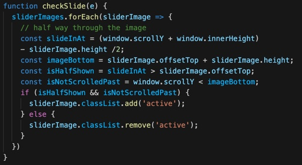

# Slide in on Scroll Template
> Check this out if you're looking for your images to slide in when you scroll

## Table of contents
* [General info](#general-info)
* [Screenshots](#screenshots)

## General info
Provide others with a piece of js code that they can implement into their projects. The code allows pictures to slide in dynamically triggered by a scroll event

## Screenshots

